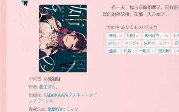
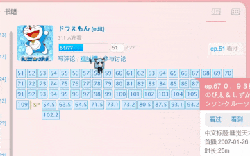
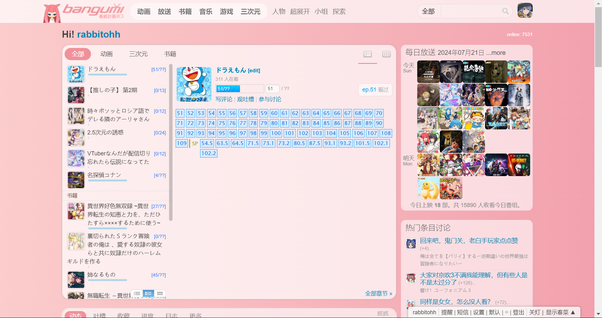
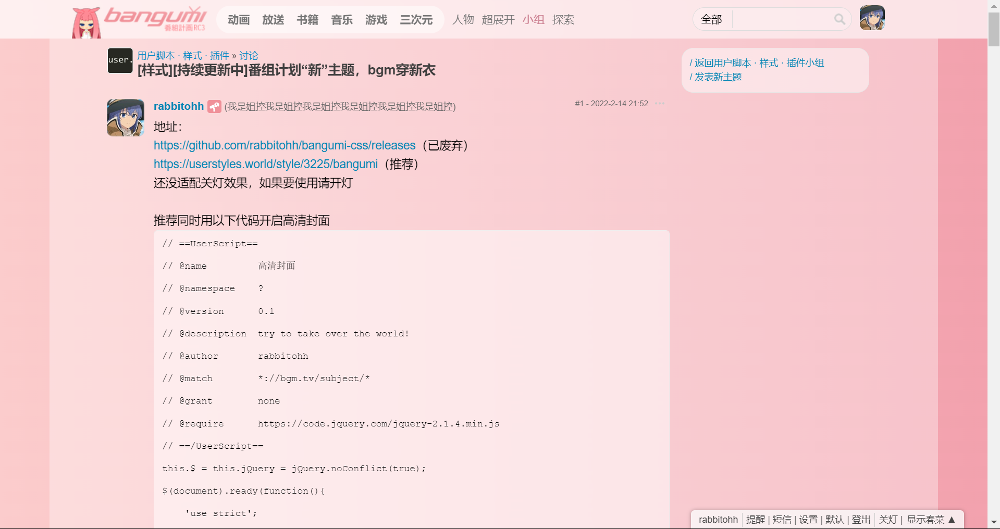
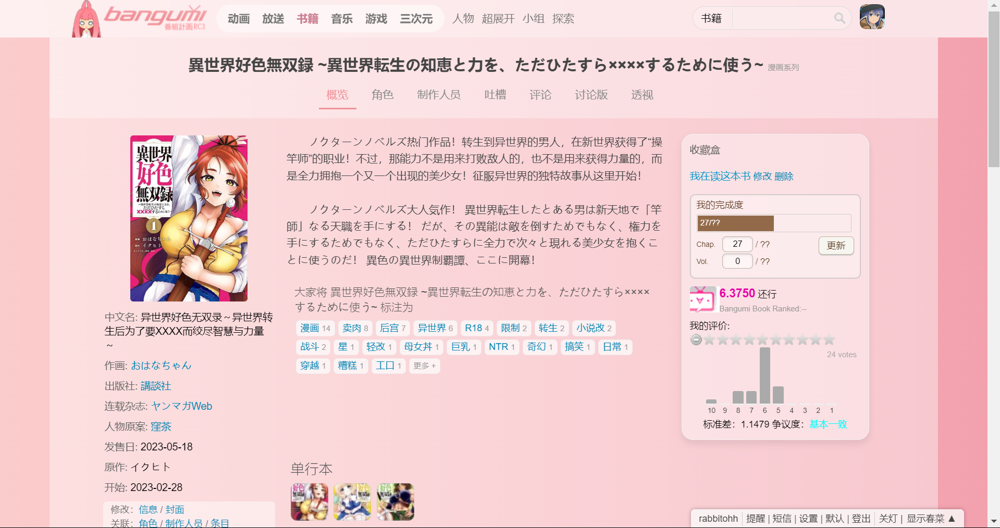
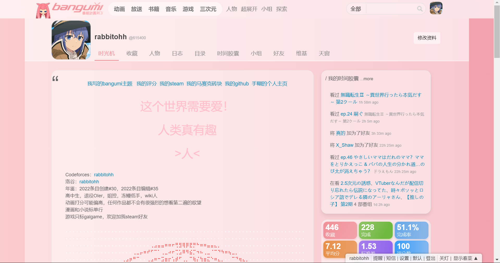

# bangumi-css

  
[](https://github.com/rabbitohh/bangumi-css/releases)
[](https://userstyles.world/style/3225/bangumi)

[](https://github.com/rabbitohh/bangumi-css/releases)


## 开源感想（？
这里该说点什么呢？本来是自用的，后来写着写着就想到能不能分享出来给大家一起用。感谢yonjar大佬提供的部分代码，感谢每一位使用者。  
  

## 食用方法：
1. 安装stylus
   - Chrome扩展：[stylus](https://chrome.google.com/webstore/detail/stylus/clngdbkpkpeebahjckkjfobafhncgmne) / [stylus(Beta)](https://chromewebstore.google.com/detail/stylus-beta/apmmpaebfobifelkijhaljbmpcgbjbdo)
   - Firefox：[stylus](https://addons.mozilla.org/en-US/firefox/addon/styl-us/)

2. 安装样式
   - 方案一：使用userstylus  
     打开[userstyles链接](https://userstyles.world/style/3225/bangumi)，点击install
   - 方案二：使用github  
     打开[github链接](https://github.com/rabbitohh/bangumi-css/raw/refs/heads/main/%E7%95%AA%E7%BB%84%E8%AE%A1%E5%88%92%E2%80%9C%E6%96%B0%E2%80%9D%E4%B8%BB%E9%A2%98%20by%20rabbitohh.user.css)，点击安装样式

## 自定义选项说明：

1. “自定义背景”，修改内容即可实现自定义背景
```
#afc9f0
```
```
url("https://lain.bgm.tv/pic/photo/l/95/f7/615400_h6Zk6.jpg")
```
```
linear-gradient(to right, rgb(56, 189, 248), rgb(59, 130, 246))
```

2. “透明度”，取值越高，越不透明 ~~（当前试运行中，仅主页生效）~~ 已上线全站  

3. 额外选项：高清封面  
使用油猴脚本：https://bgm.tv/group/topic/416403  

## find me  
我的bangumi主页：https://bgm.tv/user/615400  
bangumi讨论帖：https://bgm.tv/rakuen/topic/group/367774  

## 预览图  
<a></a>
<a></a>
<a></a>
<a></a>
<a></a>
<a></a>
<a></a>
班友作业：  
[#8](https://bgm.tv/group/topic/367774#post_1950012)
[#27](https://bgm.tv/group/topic/367774#post_2995952)
[#30](https://bgm.tv/group/topic/367774#post_3003047)
[#34](https://bgm.tv/group/topic/367774#post_3026742)
[#42](https://bgm.tv/group/topic/367774#post_3215626)
[#47](https://bgm.tv/group/topic/367774#post_3228068)
